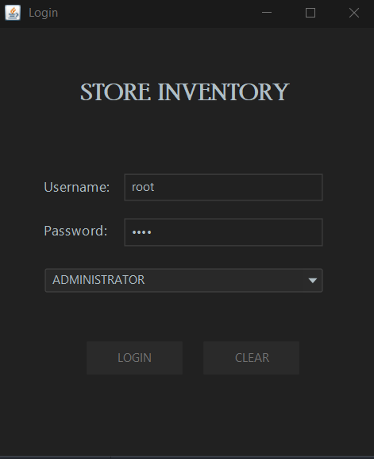
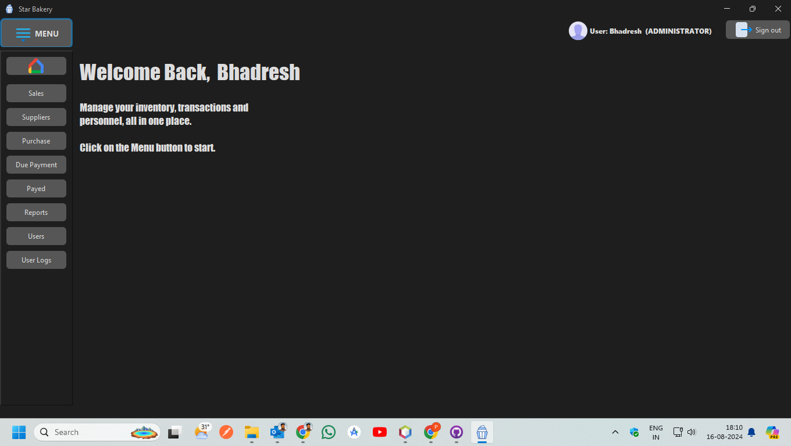
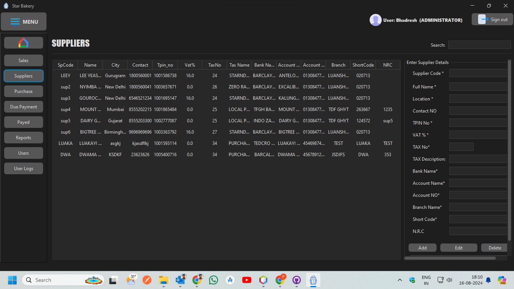
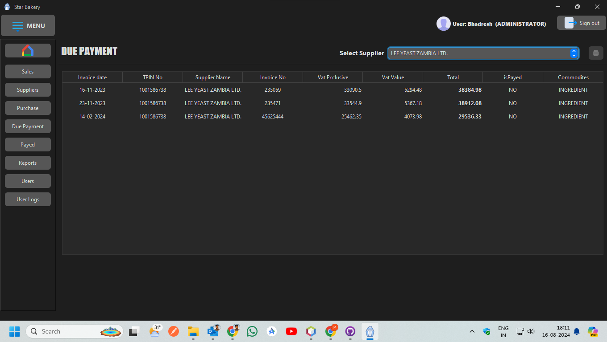
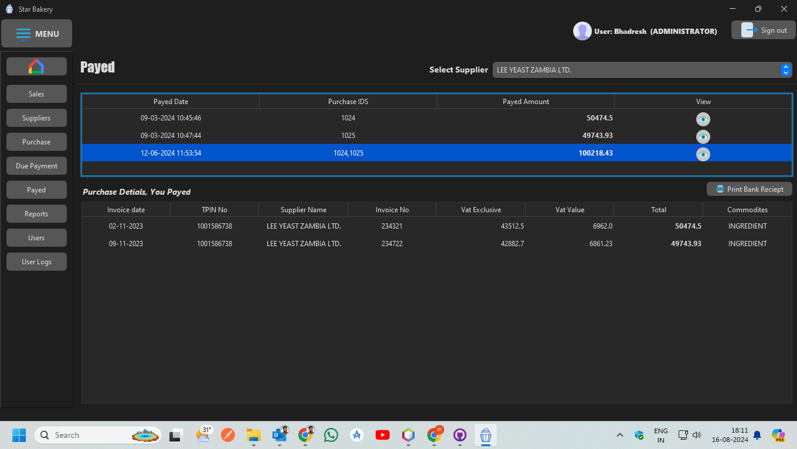
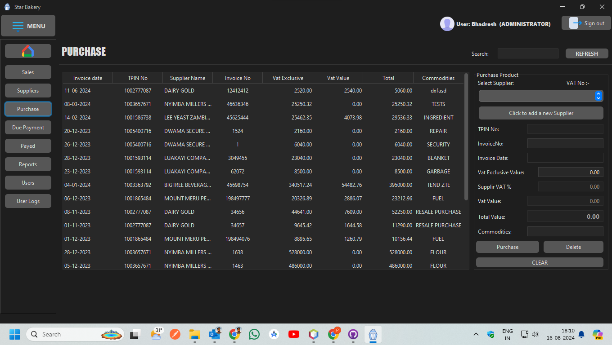
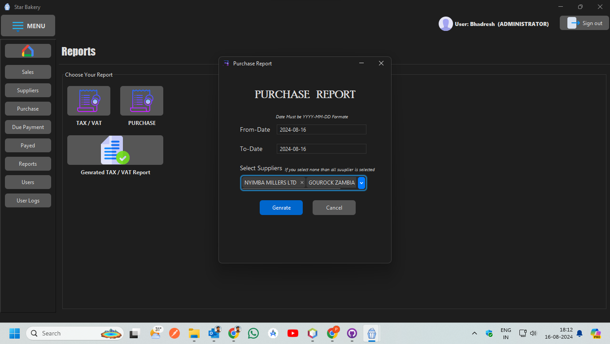
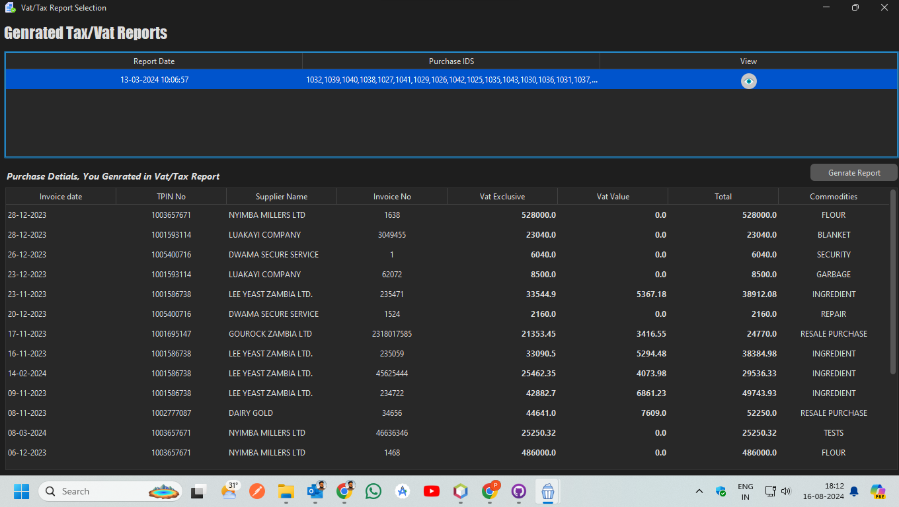

# PurchaseManagmentSystem
Purchase Management System for Zambia A Java Swing and SQLite-based system for managing purchases, calculating Zambian taxes, and generating PDF reports. Features include automated tax calculations, supplier and purchase tracking, and structured PDF reports for tax submissions and audits, ideal for small to medium-sized businesses.
This Purchase Management System built in the form of a GUI desktop application developed in ***Java*** using ***SQLite*** as its database.
The GUI was designed using **Swing** and the database connectivity was managed using **JDBC API**.

This application can be used by any small to mid-sized stores to easily maintain and manage an inventory of all their-
- Products 
- Customers 
- Suppliers
- Users 
- Transactions
- Tax & VAT

## Features of the Application

- Users can manage your purchase and stock of all the products available in their store.
- Users can manage all sales and purchase transactions made by the store.
- Supports two user types:
  1. Administrator
  2. Employee
  
  [Admins have the ability to manage all other personnel.]
- Any transaction made automatically handles the stock availability in the inventory.
- Each section includes a search feature to make it easier for users to view the data they want to see.
- Users only need to enter the product code while making a sale and all the relevant details will be retrieved from the database automatically.
- Maintains a time log of all the users using the application.

## Default credentials for the connection to MySQL database is:
    - Username: root
    - Password: root
    

### Note:

All the project dependencies are available in the [`lib`](lib/) directory.

***

## Application Preview

### Login Page

The login page takes in the credentials entered by the user and verifies with the database.

### Dashboard/Welcome Page

The landing page of the application after a successful login.

### Suppliers

Here, the user can manage and manipulate the record of all the suppliers associated with the store.

### Due Date

Allows user to see the due payment to purchased by supplier.

### Already Payed data

This section is where users can see the data of already paid the payment to supplier.
The user only needs to select the supplier and software will handle the rest, showing all the necessary details like which purchase orders payed. 

### Purchase

This section is where users can view purchase logs and enter new purchase transactions. Similar to the sales section, this section only requires the user to enter the product code and the details that are already available in the database will immediately be displayed in the respective spaces.

### Purchase Reports

This section is genrate purchase reports by filteration such as like between date wise and Supplire wise.

### TAX & VAT For Zambia

Tax & Vat shows the administrator a Calculated and selected Purchashase products in Genrate Report for submission

***

## Technologies Used

The following are the technologies that have been used in the development of this project. All of them are free to use.
  - JetBrains IntelliJ IDE
  - Apache NetBeans IDE (for the GUI designer)
  - MySQL Server and Workbench and SQLite
  - JDK 16

## Source Code

The software code has been divided into four different packages:
  - Data Access Object (DAO): Contains the data access layer of the software that interacts directly with the database and its tables. Used for retrieval and modification of data.
  - Data Transfer Object (DTO): Contains the data transfer layer that allows the data to be transferred between the data access layer and the UI layer.
  - Database: Contains the ConnectionFactory class that retrieves the database connection and verifies user credentials for the application.
  - User Interface (UI): Contains all the GUI classes making up the interface layer of the software.

Click [here](src/com/inventory/) to skip directly to the source code.

## Work-in-Progress

This project is a work in progress and more features are yet to be added with new technologies. 
